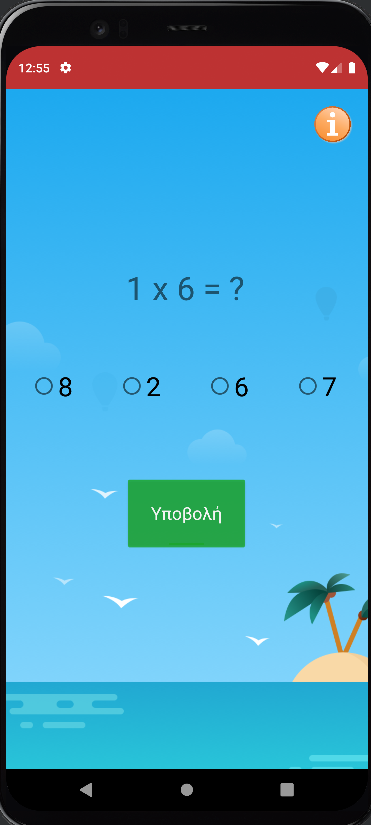

# Android-EducationalSoftware
In this project, we created an educational game as an android app in order for young students to learn and practice the multiplication table. Students can use the app , among others, to create an account, study and practice multiplication in pleasant and customized tests, choose level of difficulty, watch and improve their progress and scores. This app can also be used from teachers to assess students' performance and statistics. The app was created using Android Studio (Android Pie 9.0 - API 28). The user authentication as long as the database where implemented using Google Firebase.

 
 

